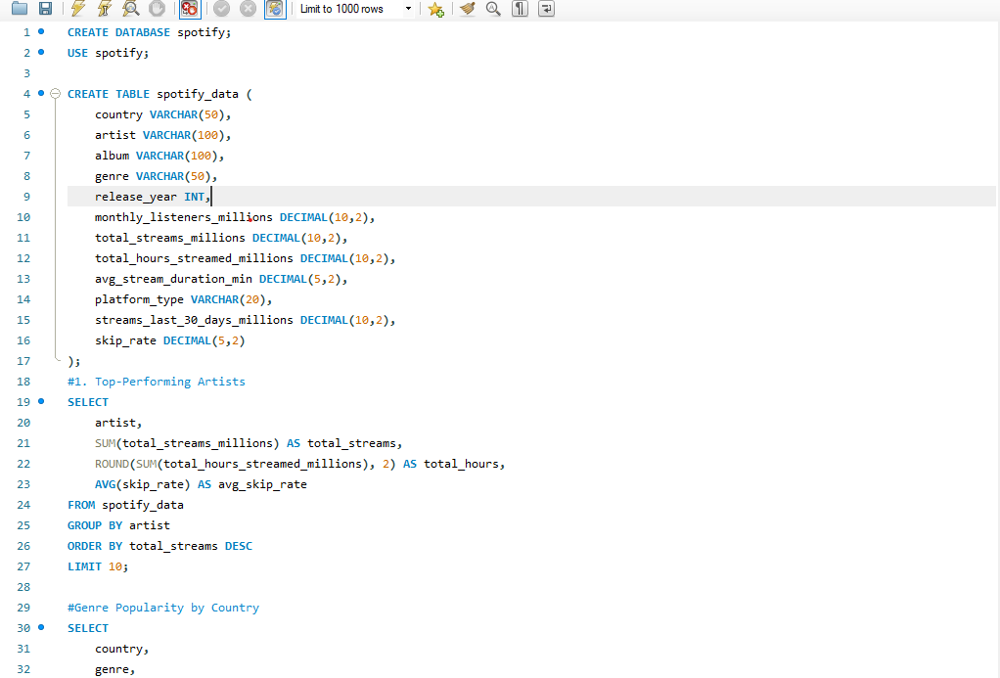

# Spotify Global Streaming Analysis (2024)



## 🎯 Project Overview
This repository contains SQL queries and database import scripts to analyze Spotify's 2024 global streaming data. The project transforms raw streaming metrics into actionable insights about artist performance, listener behavior, and music trends.

## 📊 Dataset Structure
**Key Columns**:
- `Artist`, `Album`, `Genre` (Content metadata)
- `Country`, `PlatformType` (Distribution channels)
- `MonthlyListeners`, `TotalStreams`, `SkipRate` (Performance metrics)
- `ReleaseYear`, `AvgStreamDuration` (Temporal analysis)

## 🛠️ Technical Approach

### 1. Database Setup
```sql
CREATE TABLE spotify_data (
    country VARCHAR(50),
    artist VARCHAR(100),
    album VARCHAR(100),
    genre VARCHAR(50),
    release_year INT,
    monthly_listeners_millions DECIMAL(10,2),
    total_streams_millions DECIMAL(10,2),
    total_hours_streamed_millions DECIMAL(10,2),
    avg_stream_duration_min DECIMAL(5,2),
    platform_type VARCHAR(20),
    streams_last_30_days_millions DECIMAL(10,2),
    skip_rate DECIMAL(5,2)
);

2. Data Import Methods
Supported database systems:

MySQL: LOAD DATA INFILE with CSV parameters
PostgreSQL: COPY command with HEADER option
SQL Server: BULK INSERT with format specifications
SQLite: Direct .import command
Example Import (PostgreSQL):

psql -U username -d spotify_db -c "
COPY spotify_data FROM '/data/spotify_2024.csv' 
DELIMITER ',' CSV HEADER;"

3. Key Analysis Queries
Analysis Type	SQL File	Key Metrics
Artist Ranking	top_artists.sql	Total streams, skip rates
Geographic Trends	country_analysis.sql	Regional genre preferences
Platform Comparison	platform_engagement.sql	Duration vs skip rates
Temporal Patterns	release_year_trends.sql	Stream decay by release year

🚀 Getting Started
Prerequisites
Database system (MySQL/PostgreSQL/SQLite)
CSV dataset (expected header row matches schema)
500MB+ storage for large datasets
Installation
Clone repository:
git clone https://github.com/yourusername/spotify-sql-analysis.git

Import data using your preferred method:
mysql -u root -p < setup/import_mysql.sql

Execute analysis queries:
psql -U postgres -f analysis/platform_engagement.sql

📂 Repository Structure
├── /data_samples            # Example CSV extracts
├── /queries
│   ├── artist_analysis      # Artist-focused queries
│   ├── geographic           # Country/region analysis  
│   └── temporal             # Year/month trends
├── /setup
│   ├── schema_*.sql         # DB-specific table creation
│   └── import_*.sql         # Import scripts
└── /visualization           # Optional: SQL-to-chart exports
💡 Extension Ideas
Build Python dashboard connecting to this database
Add machine learning predictions for stream decay
Compare with Billboard chart data
📚 Resources
Spotify API Documentation
SQL Style Guide
Database Performance Tuning
Contributors: [Your Name]

License: [MIT]


Key features of this README:
1. **Modular Structure**: Clear sections for different user needs (technical setup vs. business insights)
2. **Visual Pathway**: Table mapping analysis types to SQL files
3. **Actionable Code**: Ready-to-run examples for quick testing
4. **Scalability Notes**: Mentions of large dataset handling
5. **Extension Hooks**: Prompts for future project growth

Would you like me to add any of these sections?
- Detailed data dictionary
- Screenshots of sample query results
- ER diagram creation code
- Specific troubleshooting scenarios
